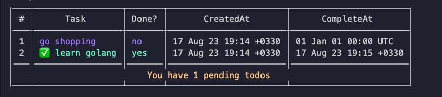

# TODO App CLI (Golang)

This is a command-line interface (CLI) application built with Go (Golang) that allows you to manage your TODO list. You can add, view, update, and delete tasks from the command line.

## Table of Contents
- [Installation](#installation)
- [Usage](#usage)
- [Commands](#commands)
- [Contributing](#contributing)
- [License](#license)

## Installation

To use this TODO App CLI, make sure you have Go installed on your machine. Then, follow these steps:

1. Clone the repository:

```bash
git clone https://github.com/amirhasanzadehpy/todo-app-cli.git
```

2. Navigate to the project directory:

```bash
cd todo-app-cli
```

3. Build the application:

```bash
go build ./cmd/todo/
```

4. Run the application:

```bash
./todo
```

## Usage

Once you have installed and run the application, you can start managing your TODO list using various commands.

To view all available commands and their usage, run:

```bash
./todo -help
```

## Commands

The following are the available commands provided by the TODO App CLI:

- `add` - Add a new task to the TODO list.
- `list` - View all tasks in the TODO list.
- `complete` - Complete a task from the TODO list.
- `delete` - Delete a task from the TODO list.
- `help` - Display help information about the CLI and its commands.

## Contributing

Contributions are welcome! If you find any issues with the TODO App CLI or would like to suggest improvements, please open an issue or submit a pull request on the GitHub repository.
